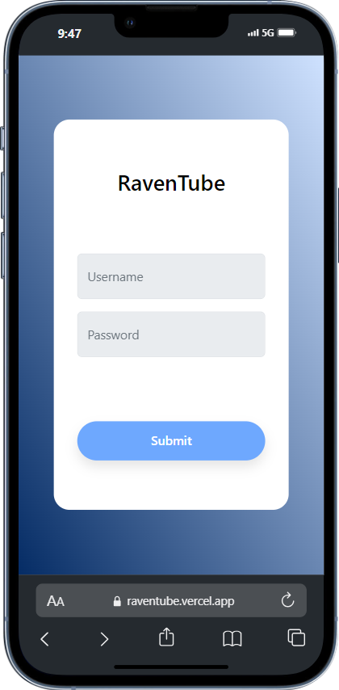
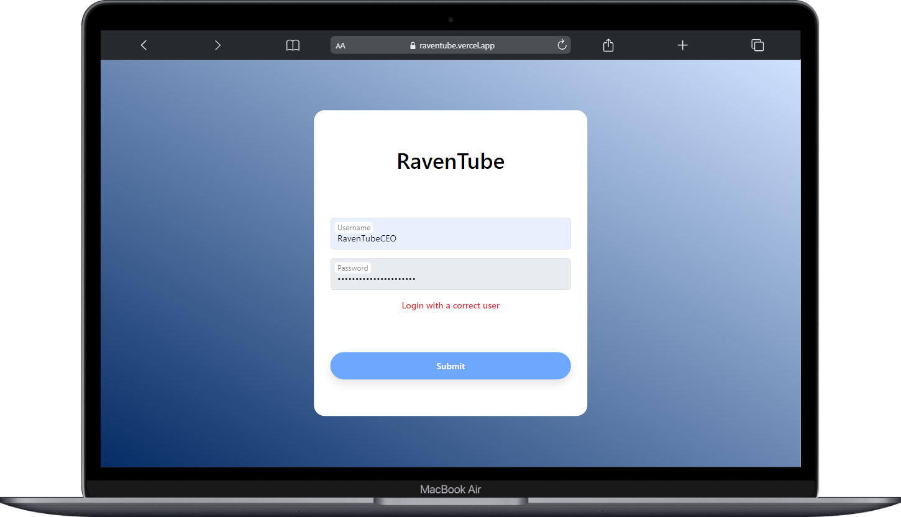
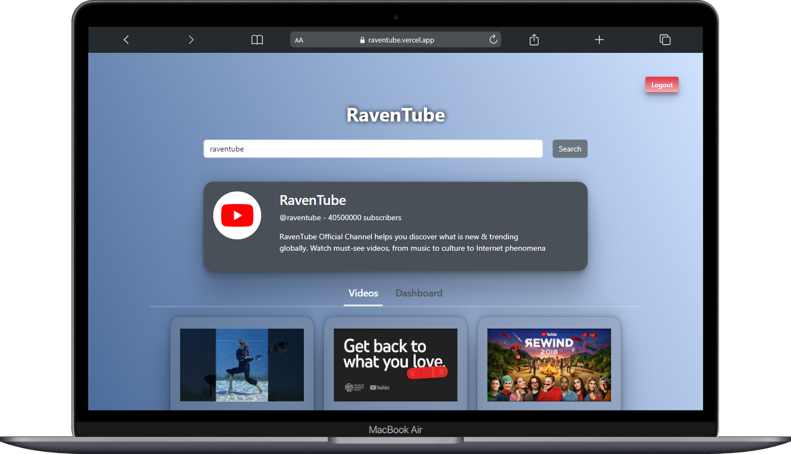
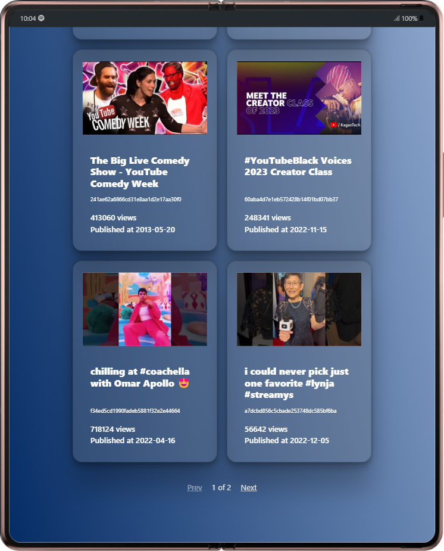
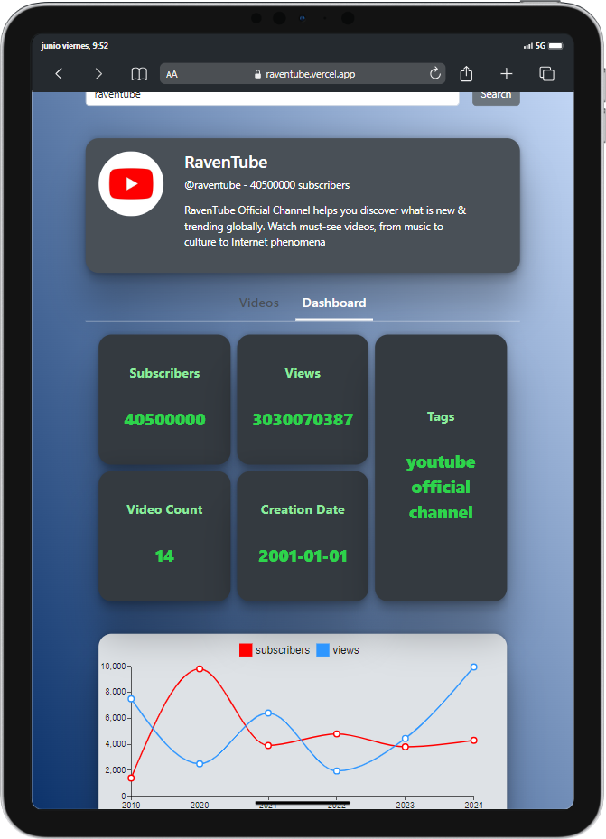

<h1 align="center">
  RavenTube: Prueba técnica
</h1>

<div align="center">
   por  <a href="https://aitormelero.dev" target="_blank">Aitor Melero</a>.
</div>
</br>
<div align="center">

[](https://es.react.dev/)
[](https://www.typescriptlang.org/)

---

</div>

<!-- INDICE -->

## Índice

- [Objetivo](#objetivo)
- [Tecnologías](#tecnologías)
- [Instalación y ejecución](#instalación-y-ejecución)
- [Uso](#uso)
- [Aspecto](#aspecto)
- [Contacto](#contacto)

<!-- OBJETIVO -->

## Objetivo

El objetivo de este proyecto es dar a conocer mis habilidades con el front-end. El contexto del proyecto se explica a continuación.

### Contexto

Imagina que uno de nuestros clientes quisiera tener acceso a un portal, mediante el cual, pueda
buscar cualquier canal de contenido de Youtube. Una vez encontrado el canal que está
buscando, le gustaría ver representada una lista paginada con los vídeos del canal, así como
alguna pestaña adicional donde pueda consultar las estadísticas e información adicional.

Para ello hay que seguir una serie de pasos a seguir:

- Diseña un formulario de login, al que solamente el CEO de la empresa puede acceder (es decir,
  valora el control de accesos), y a través del cual entrará a consultar la información.

- Una vez dentro, lo que espera encontrar es:
  - Un buscador donde pueda introducir el nombre del canal que está buscando.
  - Un listado con los vídeos del canal que contenga al menos el nombre del vídeo, la fecha
    de subida, las visitas y el hashmd5 del nombre del vídeo. Esta lista deberá de ser paginable
    para que pueda cómodamente pasar de una página a otra sin tener que hacer un scroll
    infinito.
  - Una pestaña tipo Dashboard donde pueda consultar estadísticas interesantes del canal
    en formato gráfico (visitas, vídeos subidos, timeline, tags, etc).

### Requisitos mínimos

- Completar cada uno de los pasos especificados en el ejercicio, estos son: login, lista y
  contenido del canal buscado.
- Debe realizarse en React.
- Que sea 100% responsive.
- El proyecto deberá de subirse a git (el tuyo personal o uno nuevo que te crees para este
  ejercicio). También valoraremos que lo despliegues con gh-pages o similares para poder
  verlo online.

**Extras:** cualquier añadido que consideres relevante será un plus, así como cualquier
representación gráfica o animación que creas que puede encajar con lo que el cliente nos ha pedido. Si además lo haces utilizando Typescript nos tendrás en el bote 😄

## Tecnologías

[](https://developer.mozilla.org/es/docs/Web/HTML)
[](https://developer.mozilla.org/es/docs/Web/CSS)
[](https://www.typescriptlang.org/)
[](https://developer.mozilla.org/es/docs/Web/JavaScript)
[](https://vitejs.dev/)
[](https://es.react.dev/)
[](https://reactrouter.com/en/main)
[](https://sass-lang.com/)
[](https://getbootstrap.com/)
[](https://eslint.org/)
[](https://mui.com/)

<!-- INSTALACION Y EJECUCION -->

## Instalación y ejecución

### Instalar dependencias:

```bash
npm install
```

### Crear .env con tus datos a partir del fichero .env.template

```bash
// Nombre de usuario para iniciar sesión
VITE_USERNAME='RavenTubeCEO'

// Password de usuario para iniciar sesión de prueba con datos estáticos
VITE_PASSWORD='RavenPrueba'

// URL de la API de YouTube para usar datos reales de YouTube
VITE_YT_URL='https://www.googleapis.com/youtube/v3'

// Nombre de la variable donde se guardará en el localStorage el token de inicio de sesión
VITE_TOKEN_NAME='raventube-token'
```

### Ejecutar la web en modo desarrollador:

```bash
npm run dev
```

### Ejecutar la web en modo desarrollador en una red local:

```bash
npm run dev -- --host
or
npm run host
```

### Creación de ejecutable

```bash
npm run build
```

### Ejecutar tests

```bash
npm run test
```

### Ejecutar prettier y eslint

```bash
npm run prettier
npm run lint
npm run format
```

## Uso

### Iniciar sesión

Para usar la web, lo primero que debemos hacer es iniciar sesión. Podemos iniciar sesión con dos tipos de usuario:

- **Usuario de prueba**: Si iniciamos sesión con los datos de usuario guardados en el fichero `.env` solor podremos buscar entre dos canales: _RavenTube_ y _RavenSoft_.
- **Usuario real**: Si iniciamos sesión con el nombre de usuario del fichero `.env` (al igual que con el usuario de prueba) e introducimos en el campo del password un token real de la [API de YouTube](https://developers.google.com/youtube/v3?hl=es-419), tendremos acceso a información real, es decir, podremos buscar entre todos los canales que deseemos.

### Búsqueda de canales

Para buscar un canal de YouTube simplemente debemos introducir en el campo de búsqueda el nombre exacto identificativo del canal (el que va precedido por un `@`) y pulsar en el botón de buscar.

> Nota: No hay que poner el @ en el campo de búsqueda y se pueden introducir espacios ya que estos no se consideran en la búsqueda.

Una vez ya hemos pulsado en el botón de buscar, podremos ver la lista de vídeos del canal (se muestran un máximo de 12 vídeos por página, para ver más se debe ir navegando con paginación) y un dashboard con datos interesantes del canal.

### Cerrar sesión

Para cerrar sesión simplemente se debe pulsar en el botón `Logout` de la parte superior derecha de la web.

## Aspecto

<p align="center">
  
  
  
  
  
</p>

## Contacto

### Aitor

[](https://github.com/AitorMelero)
[](https://www.linkedin.com/in/aitor-melero-pic%C3%B3n-678105293/)
